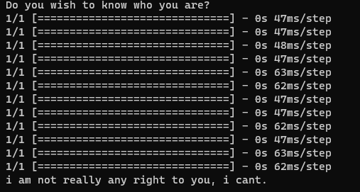
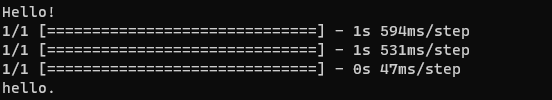
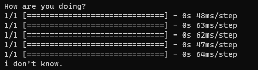
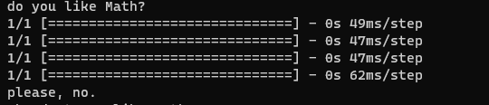
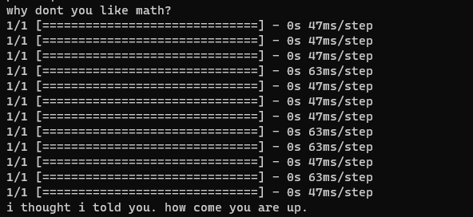
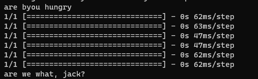
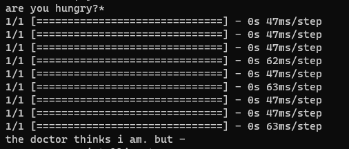
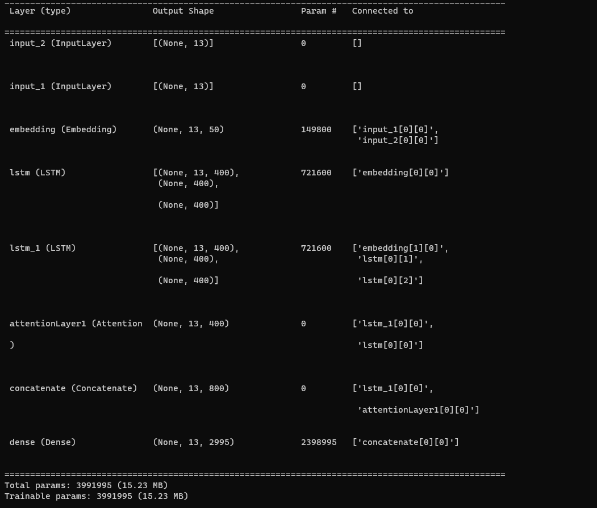

# Sequence-to-Sequence Chatbot
A sequence-to-sequence chatbot built using a deep learning model architecture comprising an encoder and decoder with LSTM layers. The model is trained on the Cornell Movie Dialogs Corpus.

### Introduction
This project implements a chatbot using a sequence-to-sequence model with attention mechanisms. The chatbot is trained on conversational data from movies to generate human-like responses.

### Features
- Sequence-to-Sequence Model: Utilizes an encoder-decoder architecture with LSTM layers.
- Attention Mechanism: Improves the model's ability to focus on relevant parts of the input sequence.
- Custom Vocabulary: Builds a vocabulary based on word frequency thresholds.
- Automatic Tokenization and Padding: Handles text preprocessing steps automatically.
+ Training and Testing Scripts: model4.py for training and test.py for testing the chatbot.

### Model Architecture
The model architecture is defined in model4.py and includes:

- Embedding Layer: Converts words into dense vectors of fixed size.
- Encoder: An LSTM layer with 400 units that processes the input sequence.
- Decoder: An LSTM layer with 400 units that generates the output sequence.
- Attention Layer: Helps the decoder focus on specific parts of the input.
- Dense Layer: Applies a softmax activation to generate word probabilities.

### Data Preprocessing
Data preprocessing is handled within model4.py and involves:

- Text Cleaning: Lowercasing, expanding contractions, and removing special characters.
* Building Vocabulary: Creating a custom dictionary based on word frequency with a threshold to filter out rare words.
- Tokenization: Converting text to sequences of integers.
- Padding/Truncating: Ensuring all sequences are of equal length (13 tokens).
- Preparing Inputs and Outputs: Generating encoder input, decoder input, and decoder output sequences suitable for training.

### Acknowledgments
Cornell Movie Dialogs Corpus: For providing the dataset used for training.

### Pictures of Trained Model Performance:
 

 

 

### Model Architecture:
